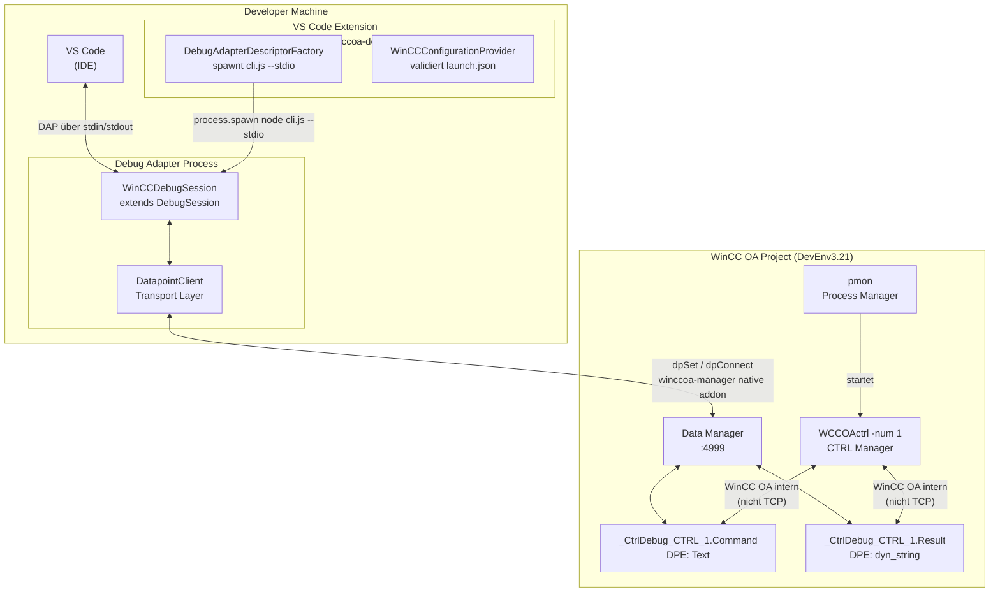
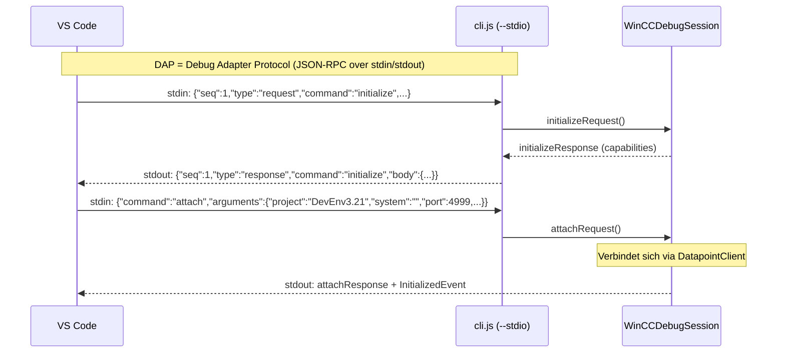
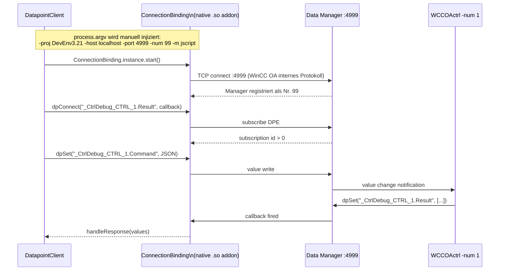
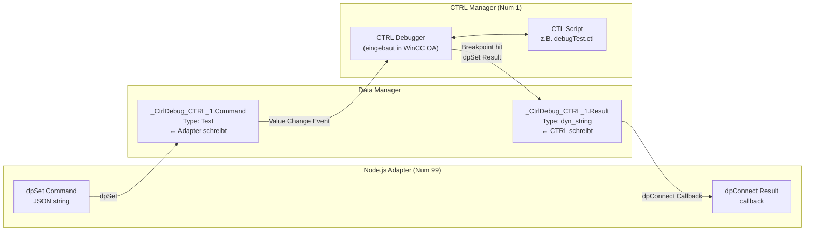
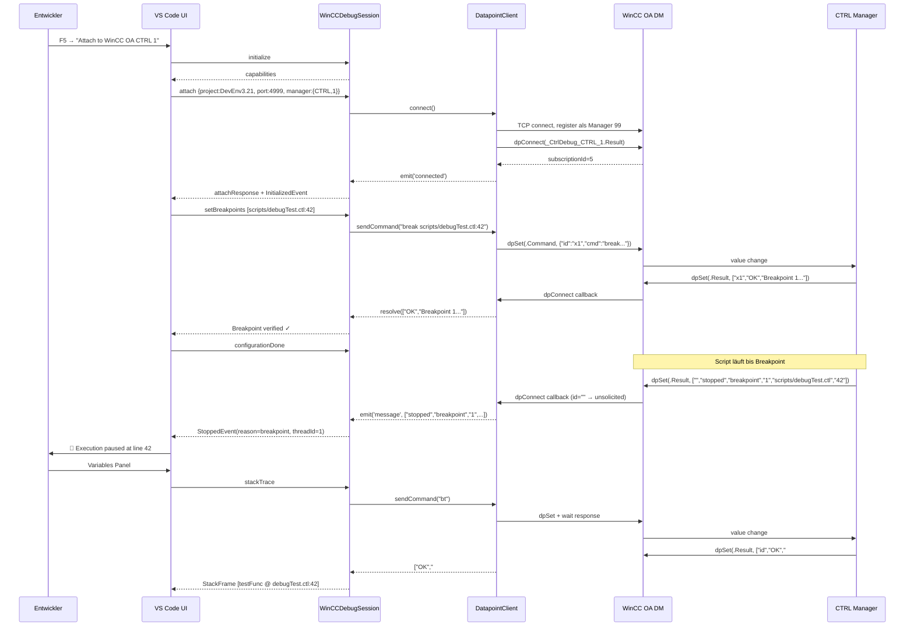
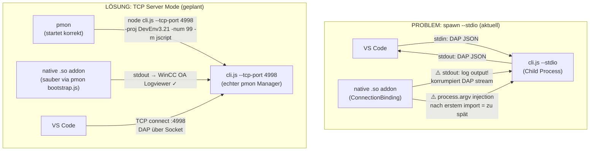

# WinCC OA VSCode Debugger — Vollständige Architektur

## 1. Systemübersicht



---

## 2. Kommunikations-Protokolle im Detail

### Ebene 1: VS Code ↔ Debug Adapter — DAP über stdio



**DAP ist KEIN HTTP.** Es ist ein JSON-Newline-delimited Protokoll das **direkt über stdin/stdout** läuft.
VS Code spawnt den Prozess und spricht mit ihm über die Standard-Pipes.

### Ebene 2: Debug Adapter ↔ WinCC OA — native winccoa-manager



**Die winccoa-manager Verbindung ist TCP** zum Data Manager Port 4999 — aber das ist das
**interne WinCC OA Protokoll** (proprietär, Siemens), nicht DAP oder HTTP.

---

## 3. WinCC OA Debugger-Seite — DP-Protokoll



### DP-Nachrichten Format

**Command (Adapter → CTRL):**
```json
{ "id": "1712345678-abc123", "cmd": "break scripts/debugTest.ctl:42" }
```

**Response (CTRL → Adapter) — Solicited:**
```json
["1712345678-abc123", "OK", "Breakpoint 1 at scripts/debugTest.ctl:42"]
```

**Response — Unsolicited (Stop-Event vom CTRL):**
```json
["", "stopped", "breakpoint", "1", "scripts/debugTest.ctl", "42"]
```

### Unterstützte Debugger-Kommandos

| Kommando | Bedeutung |
|---|---|
| `break <file>:<line>` | Breakpoint setzen |
| `clear <file>` | Alle Breakpoints in Datei entfernen |
| `continue` | Ausführung fortsetzen |
| `next` | Step Over |
| `step` | Step Into |
| `finish` | Step Out |
| `interrupt` | Pause / Break |
| `info threads` | Thread-Liste abfragen |
| `bt` | Backtrace / Call Stack |
| `info locals` | Lokale Variablen |
| `print <expr>` | Ausdruck auswerten |

---

## 4. Vollständiger Debug-Flow



---

## 5. Path Mappings

WinCC OA kennt Skript-Pfade relativ zum Projekt-Root (z.B. `scripts/debugTest.ctl`).
VS Code arbeitet mit absoluten Dateisystem-Pfaden (`/home/testus/wincc_proj/DevEnv3.21/scripts/debugTest.ctl`).

```
launch.json:
"pathMappings": {
  "/home/testus/wincc_proj/DevEnv3.21/scripts": "${workspaceFolder}/scripts"
}

VS Code Pfad:   /home/testus/wincc_proj/DevEnv3.21/scripts/debugTest.ctl
                            ↕  toWinCCOAPath()
WinCC OA Pfad:  scripts/debugTest.ctl

WinCC OA Pfad:  scripts/debugTest.ctl
                            ↕  toVSCodePath()
VS Code Pfad:   /home/testus/wincc_proj/DevEnv3.21/scripts/debugTest.ctl
```

---

## 6. Aktuelles Problem — Warum stdin/stdout versagt



### Ursachen im Detail

1. **argv-Injection kommt zu spät** — `winccoa-manager` lädt die native `.so` beim ersten `import`,
   liest `process.argv` einmalig. Da der Prozess von VS Code gespawnt wird (nicht pmon),
   fehlen die WinCC OA Args zum richtigen Zeitpunkt.

2. **stdout ist belegt** — DAP und native Addon schreiben beide auf stdout → korrupter DAP-Stream,
   VS Code kann die Antworten nicht parsen.

3. **Keine pmon-Umgebung** — pmon setzt bestimmte Umgebungsvariablen und startet `bootstrap.js`,
   das die Verbindung korrekt initialisiert (`managerStart()`, `ConnectionBinding.instance.start()`).

### Geplante Lösung: TCP-Server Mode

| | Aktuell (stdio) | Geplant (TCP) |
|---|---|---|
| Adapter wird gestartet von | VS Code (`spawn`) | pmon |
| DAP-Transport | stdin/stdout | TCP Socket :4998 |
| WinCC OA Verbindung | argv-Injection (fragil) | pmon-Args (korrekt) |
| Logs sichtbar in | nirgendwo | WinCC OA Logviewer |
| `factory.ts` nutzt | `DebugAdapterExecutable` | `DebugAdapterServer(4998)` |

---

## 7. Datei-Übersicht

| Datei | Repo | Rolle |
|---|---|---|
| `src/extension.ts` | vscode-winccoa-debugger | VS Code Extension Entry Point, registriert Factory + Provider |
| `src/debugAdapterFactory.ts` | vscode-winccoa-debugger | Erstellt den Debug Adapter Descriptor (spawn oder TCP) |
| `src/configurationProvider.ts` | vscode-winccoa-debugger | Validiert und vervollständigt `launch.json` Konfigurationen |
| `src/projectDetector.ts` | vscode-winccoa-debugger | Erkennt WinCC OA Projektverzeichnis |
| `src/cli.ts` | npm-winccoa-debugger | Entry Point des Adapter-Prozesses, parst CLI-Args |
| `src/adapter/WinCCDebugSession.ts` | npm-winccoa-debugger | DAP ↔ WinCC OA Übersetzung (alle DAP-Handler) |
| `src/connection/DatapointClient.ts` | npm-winccoa-debugger | Transport: dpSet/dpConnect via winccoa-manager native addon |

---

## 8. launch.json Referenz

```json
{
  "type": "winccoa",
  "request": "attach",
  "name": "Attach to WinCC OA CTRL 1",
  "host": "localhost",
  "port": 4999,
  "project": "DevEnv3.21",
  "system": "",
  "manager": {
    "type": "CTRL",
    "number": 1
  },
  "adapterManagerNumber": 99,
  "pathMappings": {
    "/home/testus/wincc_proj/DevEnv3.21/scripts": "${workspaceFolder}/scripts"
  },
  "trace": true
}
```

| Feld | Bedeutung |
|---|---|
| `project` | WinCC OA Projektname für `-proj` Argument (z.B. `DevEnv3.21`) |
| `system` | DP-Prefix vor Datapunktnamen (`System1:` oder `""` für Single-System) |
| `port` | Data Manager Port (Standard: 4999) |
| `manager.type` + `manager.number` | Welcher CTRL Manager debuggt werden soll |
| `adapterManagerNumber` | Manager-Nummer des Adapters selbst (darf nicht kollidieren) |
| `pathMappings` | Lokaler Pfad → WinCC OA relativer Pfad |
